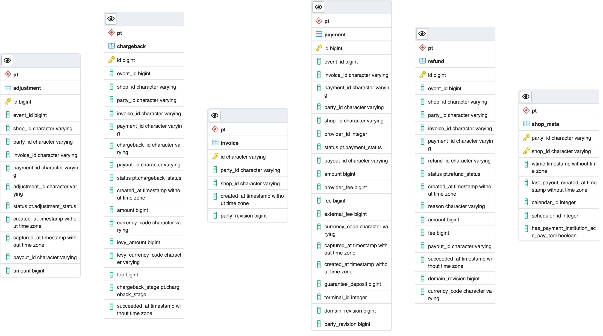
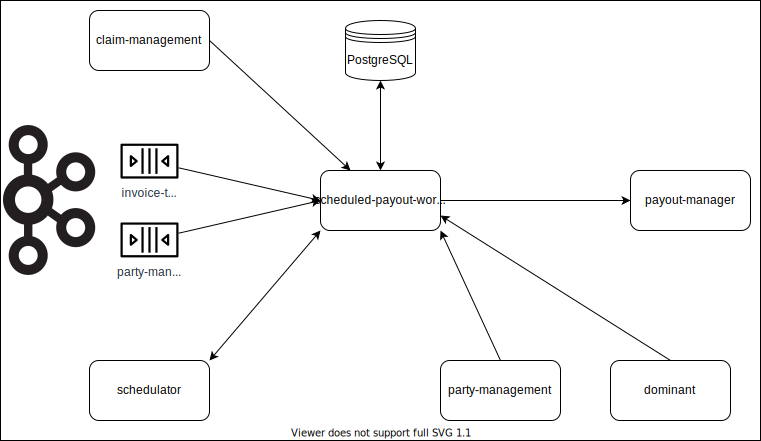

# scheduled-payout-worker

Сервис для формирования выплат по расписанию.

## Описание работы сервиса

### Верхнеуровневое описание взаимодействия

scheduled-payout-worker - сервис, предназначенный для обработки событий от сервиса [machinegun](https://github.com/rbkmoney/machinegun) с информацией о платежах и последующем формировании запроса на выплату к сервису [payout-manager](https://github.com/rbkmoney/payout-manager). 

События от сервиса machinegun поступают через Apache Kafka, данные о платежах хранятся в БД сервиса scheduled-payout-worker. Расписанием для выплат управляет отдельный сервис - [schedulator](https://github.com/rbkmoney/schedulator). При получении запроса от [schedulator'а](https://github.com/rbkmoney/schedulator) формируется запрос на выплату к сервису  [payout-manager](https://github.com/rbkmoney/payout-manager).

### Взаимодействие с Kafka

scheduled-payout-worker читает два типа событий, каждому из которых соответствует свой топик:

1. **invoice-topic**

   События с информацией о платеже (создан инвоис, начался платеж, изменился статус платежа и т.д)

   На основе полученных событий в БД сохраняется/обновляется информация об инвоисах, платежах и т.д.  

2. **party-management-topic**

   События с информацией о party/shop'е. Они делятся на два подтипа:

   2.1 События о создании shop'а, изменении платежного инструмента.

   На основе полученных событий в БД изменяется статус соответствующего shop'а (например, блокируется прием инвоисов)

   2.2 События с информацией о создании/изменении/удалении расписания выплат для магазина.

    При получении событий, связанных с расписанием выплат, формируется запрос к сервису schedulator, который, при наступлении времени выплаты, выполнит вызов сервиса scheduled-payout-worker.

### Взаимодействие с сервисом schedulator

Протокол взаимодействия описан [тут](https://github.com/rbkmoney/schedulator-proto).

Схема взаимодействия:

Сервис scheduled-payout-worker отправляет запрос на создание/удаление запланированного job'а. В случае, когда наступает время выполнения job'а, schedulator вызывает сервис scheduled-payout-worker. 

### Взаимодействие с сервисом payout-manager

Протокол взаимодействия описан [тут](https://github.com/rbkmoney/payout-manager-proto).

При получении запроса от сервиса schedulator, scheduled-payout-worker расчитывает сумму и валюту выплаты для магазина на основе данных в БД и отправляет запрос к сервису payout-manager.

### Схема БД

Помимо описанных выше взаимодействий, scheduled-payout-worker также взаимодействует с сервисами:

- [party-management](https://github.com/rbkmoney/party_management) (для получения актуальной информации о party/shop'е)
- [dominant](https://github.com/rbkmoney/dominant) (для получения актуальной информации о календаре выплат)
- [claim-management](https://github.com/rbkmoney/claim-management) (сервис может присылать запросы на создание/удаление расписания выплат)

Общая схема взаимодействия отображена ниже:

